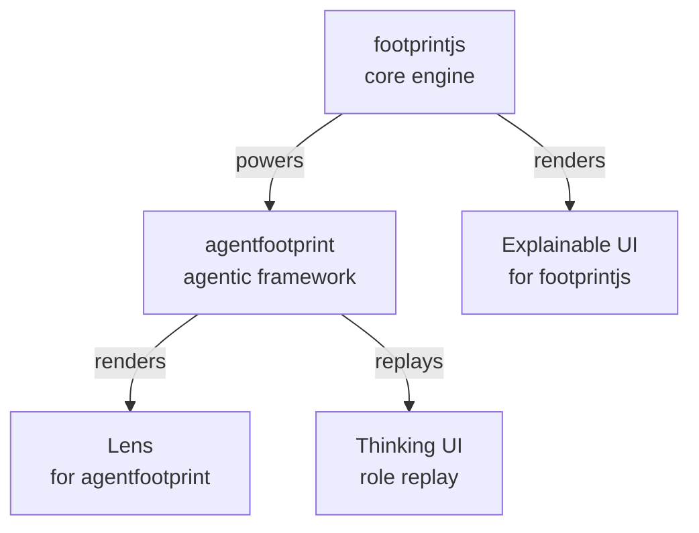

# footprintjs

### The flowchart pattern for software — systems that explain themselves.

**→ [footprintjs.github.io](https://footprintjs.github.io/)**

A flowchart is how a person draws a system: a box for each step, an arrow for what
happens next. footprintjs makes your code *be* that flowchart — so the thing that
runs is the thing you read, and every run records **why** it did what it did.

One pattern, all the way up the stack: from a backend pipeline to an AI agent.

---

## The ecosystem — as its own flowchart

| Project | Role | Links |
|---|---|---|
| **footprintjs** | the flowchart pattern for backend code | [home](https://footprintjs.github.io/footPrint/) · [repo](https://github.com/footprintjs/footPrint) · [npm](https://www.npmjs.com/package/footprintjs) |
| **agentfootprint** | AI agents that trace every LLM call back to its cause | [home](https://footprintjs.github.io/agentfootprint/) · [docs](https://footprintjs.github.io/agentfootprint/docs) · [repo](https://github.com/footprintjs/agentfootprint) · [npm](https://www.npmjs.com/package/agentfootprint) |
| **Explainable UI** | visualize a footprintjs run | [demo](https://footprintjs.github.io/explainable-ui/) · [repo](https://github.com/footprintjs/explainable-ui) · [npm](https://www.npmjs.com/package/footprint-explainable-ui) |
| **Lens** | debug an agentfootprint run | [repo](https://github.com/footprintjs/agentfootprint-lens) · [npm](https://www.npmjs.com/package/agentfootprint-lens) · *demo soon* |
| **Thinking UI** | replay an agent run for non-developers | [demo](https://footprintjs.github.io/agentThinkingUI/) · [repo](https://github.com/footprintjs/agentThinkingUI) · [npm](https://www.npmjs.com/package/agentthinkingui) |

---

## Principles

1. **Collect at traversal time.** Reads, writes, and decisions are captured structurally as the run executes — no manual logging.
2. **One canonical footprint.** The trace *is* the execution record — built inline, never rebuilt after the fact.
3. **You choose the lens.** Metrics, narrative, visualization, agent debugging — every tool composes on the same record.

> Inline recording is truth. Post-processing is reconstruction.

---

## Built for agents

The hardest question in an agentic system is *why did it do that?* — which context,
which tool, which decision led to the output. The flowchart pattern answers it by
construction: **agentfootprint** is the pattern's first real implementation, and the
rest of the stack renders and replays that record for engineers and non-developers alike.

---

This repo is the source of **[footprintjs.github.io](https://footprintjs.github.io/)** — a static, no-build page. Edit, commit, push to `main`; GitHub Pages rebuilds.

open source · [MIT](https://github.com/footprintjs/footPrint/blob/main/LICENSE) · © 2024–present [Sanjay Krishna Anbalagan](https://github.com/sanjay1909)
